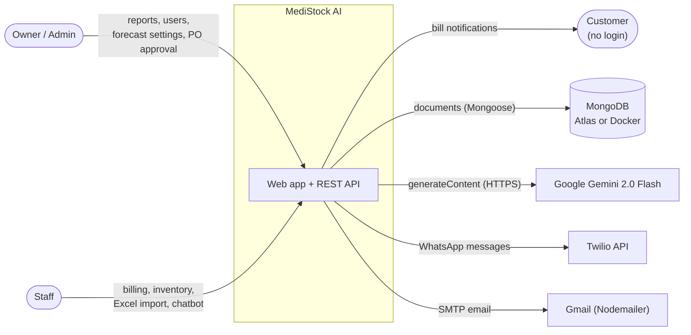
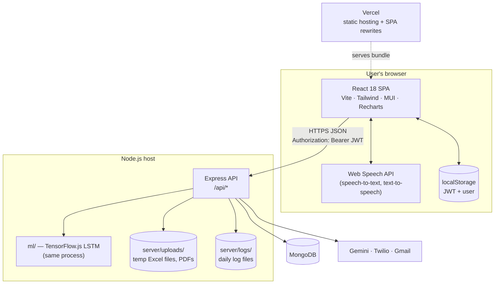
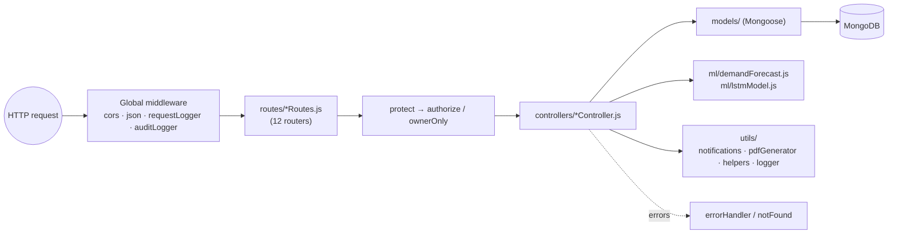

# Architecture

> **TL;DR** — A **modular monolith**: one React SPA and one Express API process backed by one MongoDB database. The API is layered (routes → middleware → controllers → models). Machine learning runs *inside* the API process with TensorFlow.js; the LLM (Gemini) and messaging (Twilio, Gmail) are external services called only from the server.

---

## 1. System context

Who and what the system talks to.

---

## 2. Containers

What runs where.

**Key points**

- The **frontend is a static bundle**. `vercel.json` rewrites every path to `index.html` so client-side routing works on refresh.
- The **API is stateless apart from two in-memory structures**: the chatbot's per-user conversation history (`Map` in `chatbotController.js`) and the TensorFlow.js runtime. This matters for scaling — see [Known limitations](#known-limitations).
- **Secrets live only on the server** (`server/.env`). The browser never sees the Gemini key; see [ADR-0004](adr/0004-gemini-via-backend.md).

---

## 3. Inside the API

Full detail in [backend.md](backend.md).

---

## 4. Tech stack and why

| Layer | Choice | Why this fits |
|-------|--------|---------------|
| UI framework | **React 18 + Vite** | Component model suits a dashboard-heavy app; Vite gives fast dev reloads |
| Styling / UI kit | **Tailwind CSS + MUI** (+ Recharts for charts) | Tailwind for layout speed, MUI for complex widgets (data grid, date pickers) |
| API | **Node.js + Express** (ES modules) | Same language as the frontend; thin, well-known framework |
| Database | **MongoDB + Mongoose** | Medicine batches nest naturally inside a medicine document; flexible schema for audit `details` — see [ADR-0001](adr/0001-mongodb.md) |
| Auth | **JWT** (`jsonwebtoken`) + **bcryptjs** + optional **TOTP 2FA** (`speakeasy`, `qrcode`) | Stateless API, no session store — see [ADR-0002](adr/0002-jwt-auth.md) |
| Forecasting | **TensorFlow.js LSTM** in the API process | No separate Python service to deploy — see [ADR-0003](adr/0003-in-process-forecasting.md) |
| Assistant | **Gemini 2.0 Flash** over REST, via backend | Cheap, fast, multilingual; key kept server-side — see [ADR-0004](adr/0004-gemini-via-backend.md) |
| Voice | **Web Speech API** + custom Tamil phonetic fallback | Free, in-browser; works without a native Tamil voice |
| Notifications | **Twilio** (WhatsApp), **Nodemailer** (Gmail SMTP) | Pharmacy customers in India are reachable on WhatsApp |
| Documents | **PDFKit** (invoices), **xlsx** (Excel import/export), **Multer** (uploads) | |
| Tests | **Jest + Supertest** | |
| Release | **release-please** GitHub Action | Conventional-commit changelogs and version bumps |

---

## 5. Feature map

Traces each feature from the screen to the data.

| Feature | Page (`src/pages/`) | API | Controller | Main models |
|---------|---------------------|-----|------------|-------------|
| Login + 2FA | `Login.jsx` | `/api/auth/login`, `/login/verify-2fa` | `authController` | User, AuditLog |
| Dashboard KPIs | `Dashboard.jsx` | `/api/reports/dashboard/*` | `reportController` | Medicine, Bill |
| Inventory & batches | `Inventory.jsx`, `MedicineInventory.jsx` | `/api/inventory/*` | `inventoryController` | Medicine, InventoryHistory |
| Billing | `Billing.jsx` | `/api/billing` | `billingController` | Bill, Medicine, InventoryHistory, Customer |
| Customers | `Customers.jsx` | `/api/customers/*` | `customerController` | Customer |
| Excel import/export | `ExcelUpload.jsx` | `/api/uploads/*` | `uploadController` | Medicine, AuditLog |
| Alerts | (Dashboard / Inventory) | `/api/alerts/*` | `alertController` | Alert, Medicine |
| Stock intelligence | `StockIntelligence.jsx` | `/api/inventory/intelligence` | `inventoryController` | Medicine, InventoryHistory |
| Forecast settings + run | `ai/DemandSetup.jsx` | `/api/forecast/parameters`, `/api/forecast/run` | `forecastController` + `ml/` | ForecastParameters, PurchaseOrder, Supplier |
| Forecast review | `ai/ForecastReview.jsx` | `/api/forecast/recommendations`, `/trend` | `forecastController` | PurchaseOrder |
| Reorder & suppliers | `reorder/ReorderReview.jsx`, `reorder/SupplierManagement.jsx` | `/api/suppliers/*` | `supplierController` | Supplier, PurchaseOrder, Medicine |
| Reports | `Reports.jsx`, `FinancialReports.jsx` | `/api/reports/*` | `reportController` | Bill, Medicine, InventoryHistory |
| Users | `admin/UserManagement.jsx` | `/api/auth/users*`, `/register` | `authController` | User |
| Activity log | `ActivityLog.jsx` | `/api/audit/*` | `auditController` | AuditLog |
| Voice assistant | `components/Chatbot.jsx` | `/api/chatbot/query` | `chatbotController` | Medicine, Bill |

> **Note on the root README:** it describes a *prescription upload and approval* workflow. That workflow is **not implemented** in the current API — `/api/uploads` handles **Excel inventory import**. Only an unused `generatePrescriptionPDF` helper remains in `utils/pdfGenerator.js`.

---

## 6. Cross-cutting concerns

| Concern | How it's handled | Where |
|---------|------------------|-------|
| Logging | `log(level, message, data)` writes to console and a daily file `server/logs/app-YYYY-MM-DD.log` | `utils/logger.js` |
| Auditing | Every successful `POST/PUT/PATCH/DELETE` is recorded after the response is sent; some actions (login, forecast run, Excel upload) are also written explicitly | `middleware/auditLogger.js` |
| Errors | Controllers mostly `try/catch` and return `{ success: false, message, error }`; uncaught errors go to `errorHandler` | `middleware/errorHandler.js` |
| Authorization | `protect` (JWT) + `authorize(...roles)` / `ownerOnly` per route; `ProtectedRoute` on the client | `middleware/auth.js`, `src/components/ProtectedRoute.jsx` |
| Notifications | Email and WhatsApp helpers that degrade gracefully if credentials are missing | `utils/notifications.js` |

---

## Design decisions

- **Modular monolith over microservices.** A single pharmacy (or a handful) is a small workload; one deployable is far easier to run and debug. Module boundaries (one router + controller per resource) keep a later split possible.
- **Batches embedded in `Medicine`.** Reading a medicine returns all its batches in one query — exactly what billing, FEFO sorting, and the chatbot need. See [data-model.md](data-model.md).
- **ML in-process.** Avoids a second runtime (Python) and network hop, at the cost of CPU contention with API requests. See [ADR-0003](adr/0003-in-process-forecasting.md).
- **AI proposes, humans approve.** Forecasting only creates `AI_Draft` purchase orders; a person must approve them. This keeps a bad forecast from spending money.
- **External calls are best-effort.** Gemini failure falls back to keyword answers; notification failure does not fail the bill.

## Known limitations

- **Single-instance assumptions.** Chatbot history is an in-memory `Map`, and the logger writes to local disk. Running two API instances would give users inconsistent chat context and split logs.
- **Heavy work on the request path.** `POST /api/forecast/run` trains one LSTM per medicine synchronously, blocking that request (and competing for CPU with others) for the whole run.
- **No multi-document transactions.** Billing updates several documents per item without a transaction; see [core-flows.md](core-flows.md#known-limitations).
- **No scheduler.** Alerts and forecasts are generated only when a user triggers them.

## Future improvements

- Move forecasting to a **background job queue** (e.g. BullMQ + Redis) with nightly scheduled runs and persisted models.
- Move chatbot memory to **Redis** or MongoDB so the API can scale horizontally behind a load balancer.
- Ship logs to a **central log store** and add metrics (request latency, forecast duration, Gemini error rate).
- Add a **scheduler** for alert generation and expiry checks.
- For multi-branch pharmacies: add a `storeId` (tenant key) to every collection and index it.

---

## Related files

- `server/server.js` — bootstrap and router mounting
- `src/App.jsx` — client routing
- `docker-compose.yml`, `vercel.json` — runtime topology
- `src/components/landing/Architecture.jsx` — marketing version of this diagram (keep in sync)
