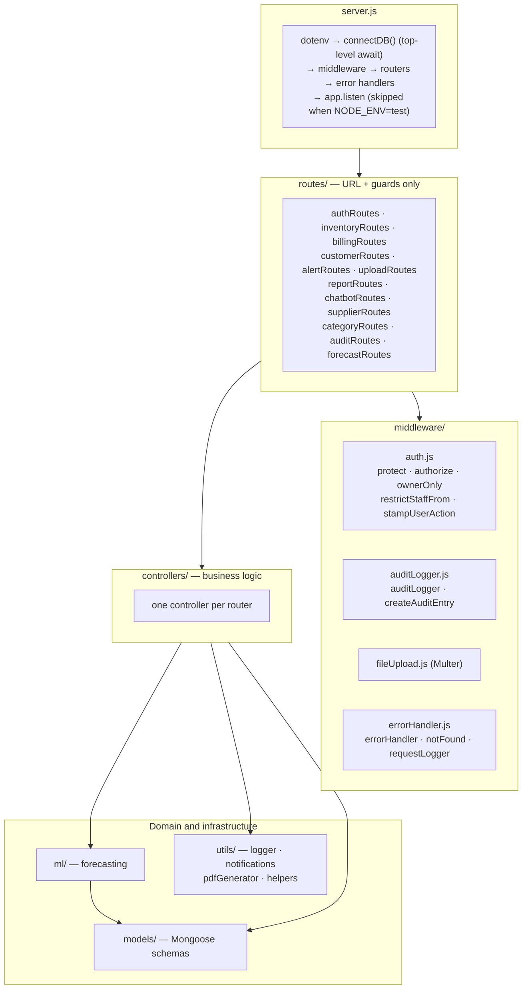
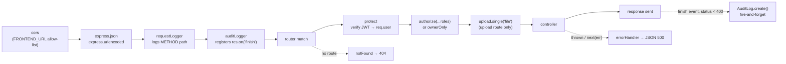

# Backend

> **TL;DR** — An Express app written as ES modules (`server/server.js`). Each resource has a **router** (URL + guards) and a **controller** (logic), and uses **Mongoose models**. Global middleware handles CORS, body parsing, request logging, and post-response audit logging. Auth is a JWT check (`protect`) followed by a role check (`authorize` / `ownerOnly`) per route.

---

## 1. Layers



**Rule of thumb when adding code:** routers declare *who may call what*; controllers do the work; anything reused across controllers goes into `utils/` (pure helpers) or `ml/` (forecasting).

---

## 2. Request pipeline

Order matters. This is the path of an authenticated, mutating request such as `POST /api/billing`:



Things worth knowing:

- **Audit logging runs after the response.** `auditLogger` only subscribes to the response's `finish` event, so by the time it writes, `protect` has already set `req.user`. The client never waits for the audit write, and a failed audit write can't fail the request. It skips `GET` requests, `/api/auth/login`, and any response with status ≥ 400. Sensitive body keys (`password`, `token`, `secret`, `key`, `auth`) are redacted.
- **`requestLogger` runs before `protect`**, so the `userId` and `userRole` in request logs are always empty. Controller-level logs carry the user.
- **CORS** allows requests with no `Origin` (curl, server-to-server) and any origin listed in the comma-separated `FRONTEND_URL`.
- **`/uploads` static route** serves files with `X-Content-Type-Options: nosniff`, `Content-Security-Policy: default-src 'none'`, and `X-Frame-Options: DENY`, so an uploaded file can't execute as a page.
- **Health check:** `GET /api/health` (no auth).

---

## 3. Router mount table

| Mount path | Router | Guard pattern |
|------------|--------|---------------|
| `/api/auth` | `authRoutes` | Login public; user management `ownerOnly` |
| `/api/audit` | `auditRoutes` | Owner only |
| `/api/inventory` | `inventoryRoutes` | Read: any user; write: owner/staff; delete + intelligence: owner |
| `/api/billing` | `billingRoutes` | Read: any user; create: owner/staff |
| `/api/customers` | `customerRoutes` | Delete: owner |
| `/api/alerts` | `alertRoutes` | Generate/resolve: owner/staff |
| `/api/uploads` | `uploadRoutes` | Excel import: owner/staff |
| `/api/reports` | `reportRoutes` | Sales and purchase reports: owner |
| `/api/chatbot` | `chatbotRoutes` | Any logged-in user |
| `/api/suppliers` | `supplierRoutes` | Supplier create/update + PO activation: owner |
| `/api/categories` | `categoryRoutes` | Approve: owner |
| `/api/forecast` | `forecastRoutes` | `router.use(protect)`; run + parameter save: owner |

Endpoint-level detail: [api-reference.md](api-reference.md).

---

## 4. Response and error contract

Successful responses:

```json
{ "success": true, "message": "optional", "<resource>": { } }
```

Controller-handled errors, the common case:

```json
{ "success": false, "message": "Human readable", "error": "err.message" }
```

Auth errors carry a machine-readable `errorCode`:

| Status | `errorCode` | Raised by |
|--------|-------------|-----------|
| 401 | `INVALID_TOKEN` | `protect`: missing, bad or expired token |
| 401 | `NOT_AUTHENTICATED` | `authorize` without `req.user` |
| 403 | `UNAUTHORIZED_ACCESS` | `authorize`: role not allowed (also returns `requiredRoles`) |
| 403 | `OWNER_ONLY` | `ownerOnly` |
| 403 | `STAFF_RESTRICTED` | `restrictStaffFrom` (defined and imported in `reportRoutes`, but not applied to any route yet) |

Uncaught errors reach `errorHandler`, which returns `{ success: false, message }` plus `stack` when `NODE_ENV=development`.

---

## 5. Conventions

- **ES modules** throughout (`"type": "module"`); import paths include the `.js` extension.
- **Models export named bindings**, guarded against re-compilation (`mongoose.models.X || mongoose.model(...)`), which lets tests re-import safely.
- **`server.js` exports `app`** (`export default app`) so Supertest can drive it without opening a port.
- **Logging:** use `log(level, message, data)` from `utils/logger.js` rather than `console.*`. Levels are `INFO`, `WARN` and `ERROR`.
- **Explicit audit entries:** for richer detail than the generic middleware captures, call `createAuditEntry({...})` from the controller. Login and Excel upload do this.
- **Generated identifiers:** bills are `BILL-<timestamp>-<random>`; AI purchase orders are `PO-AI-<timestamp>-<random>`.

---

## 6. Utilities

| Module | Responsibility |
|--------|----------------|
| `utils/logger.js` | Console + daily file logging to `server/logs/` |
| `utils/notifications.js` | `sendEmailNotification` (Nodemailer), `sendWhatsAppNotification` (Twilio), `sendBillNotification`, `sendAlertNotification`. The Twilio client is created only if credentials exist. |
| `utils/pdfGenerator.js` | Invoice PDFs via PDFKit (plus an unused prescription-report generator) |
| `utils/helpers.js` | JWT generation, expiry maths, stock status, FEFO sort, anomaly detection, bill number, a simple demand-forecast helper used by `/api/reports/forecast` |

---

## Design decisions

- **Thin routers, fat controllers.** Guards are visible at a glance in the router file; the controller never has to check roles itself.
- **Fire-and-forget audit logging.** Auditing must never slow down or break a sale. The trade-off is that audit writes can be lost silently (they are only logged).
- **Explicit per-route guards** rather than one global guard. Public routes (`/login`, `/health`) need no special-casing, but every new route must remember to add `protect`.
- **Owner as superuser.** `authorize()` always lets `owner` through, so routes list only the *minimum* roles needed.

## Known limitations

- **Inconsistent error handling.** Most controllers catch their own errors and return `500` with the raw `error.message`, so `errorHandler` is rarely reached, and internal messages can leak to clients.
- **No input validation layer.** `express-validator` is installed but unused; controllers check fields by hand. `saveDemandParameters` passes `req.body` straight into `findOneAndUpdate`.
- **Audit action mapping is coarse.** Any `POST`/`PUT` under `/api/inventory` is recorded as `MEDICINE_CREATED`. The category route maps to `CATEGORY_CREATED` / `Category Management`, which are not in the `AuditLog` enums, so those audit writes fail validation and are dropped (logged as `ERROR`).
- **Excel uploads are audited twice**: once explicitly in the controller, once by the middleware.
- **N+1 queries** in loops (billing items, alert generation, forecasting) issue one or more queries per medicine.
- `getInventoryIntelligence` loads **all** sale history into memory and filters it per medicine (O(medicines × history)).

## Future improvements

- A shared `asyncHandler` wrapper plus typed error classes so every error goes through `errorHandler`, with messages sanitised in production.
- Request validation with `express-validator` or `zod` at the router level.
- `helmet` for security headers and `express-rate-limit` on `/api/auth/*`.
- Replace N+1 loops with aggregation pipelines (`$lookup`, `$group`) or batched queries.
- Structured JSON logs with a request ID, shipped to a central store.

---

## Related files

`server/server.js` · `server/routes/` · `server/middleware/` · `server/controllers/` · `server/utils/` · `server/config/database.js`
