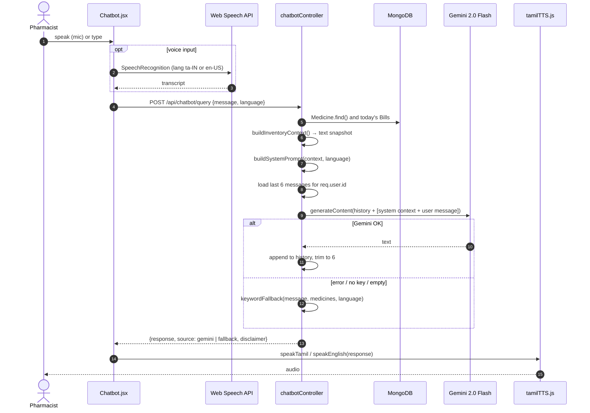

# Voice Assistant (Chatbot)

> **TL;DR** — A floating chat widget (`Chatbot.jsx`) takes typed or spoken questions in **English or Tamil**, sends them to `POST /api/chatbot/query`, and reads the answer aloud. The server builds a **live inventory snapshot**, injects it into a system prompt, and calls **Gemini 2.0 Flash**, keeping the last 3 exchanges per user as memory. If Gemini fails, a **keyword-based fallback** answers from the same data. The API key never leaves the server.

---

## 1. Request flow

---

## 2. Prompt construction

**Inventory context.** Rebuilt on every request from the live database:

- Summary: total medicines, low-stock count, today's sales total and bill count.
- One line per medicine: name, category, **active batches** (only `quantity > 0` and not expired) with rack, quantity and expiry, total quantity, and price. A medicine with no active batch is labelled *"Out of Stock / Expired"*.

**System directives** (in `buildSystemPrompt`):

1. A medicine is in stock **only** if it has an active batch.
2. If it's unavailable, suggest in-stock alternatives from the **same category**.
3. Always state the **rack number** when confirming stock.
4. Keep a clinical tone; **no medical advice** (dosage, diagnosis), inventory questions only.
5. Respond in Tamil or English, following the `language` field.

**Generation config:** `temperature 0.3` (factual, low creativity), `maxOutputTokens 600`, `topK 40`, `topP 0.95`.

**How the prompt is sent.** Gemini's `contents` array has no system role here, so the system prompt is prepended to the latest user turn inside `[SYSTEM CONTEXT - HIDDEN FROM USER] … [END SYSTEM]` markers. Earlier turns go in as plain `user` / `model` messages.

---

## 3. Conversation memory

- `userChatHistories`: an in-process `Map<userId, Array<{role, text}>>`.
- Keeps the last **6 messages** (3 exchanges) per user.
- Only the plain question and answer are stored, not the inventory snapshot, so memory stays small and each answer uses fresh stock data.

---

## 4. Fallbacks, in layers

| Layer | Trigger | Behaviour |
|-------|---------|-----------|
| Server keyword fallback | Gemini throws, times out, no API key, or an empty candidate | Matches "low stock"/"reorder", "expir", or a medicine name (first word); answers in the selected language |
| Client fallback | The backend request fails entirely | `getSmartResponse` can use a predefined keyword→answer map; the widget passes `null`, so it shows an error message instead |
| TTS fallback | No Tamil system voice | `tamilTTS.js` converts Tamil script to an English phonetic approximation and speaks it with an available voice |

The response always includes `source` so the UI (and debugging) can tell which path answered.

---

## 5. Tamil speech

- **Speech-to-text:** browser `SpeechRecognition` / `webkitSpeechRecognition` with `lang = 'ta-IN'` or `'en-US'` (Chrome-family browsers).
- **Text-to-speech:** `speechSynthesis`. `speakTamil` first looks for a voice whose `lang` or name matches Tamil (`ta`, `tam`, `tamil`). If none is found, or `usePhonetic` is set, `convertTamilToPhonetic` maps Tamil letters and syllables (`க → ka`, `கா → kaa`, …) to Latin text that an English voice can pronounce reasonably well.
- **Why:** many low-cost Android phones and older PCs in pharmacies have no Tamil TTS voice installed, and the phonetic fallback keeps voice output working on them.

---

## Design decisions

- **Retrieval by context stuffing, not RAG.** A single pharmacy has hundreds, not millions, of SKUs, so the whole inventory fits in the prompt. No vector store or embeddings to maintain, and the answer always reflects live stock.
- **Server-side proxy for the LLM.** Keeps the key secret, allows auth and auditing, and lets the server add live data. See [ADR-0004](adr/0004-gemini-via-backend.md).
- **Low temperature and strict directives** to reduce hallucinated stock or rack numbers.
- **Graceful degradation.** A pharmacy counter can't stall because an external AI is down, so a deterministic fallback always answers.
- **Browser speech APIs** cost nothing and add no server dependency.

## Known limitations

- **Prompt size grows with the catalogue.** Every request sends *every* medicine. With thousands of SKUs this hits token limits and raises cost and latency.
- **Two full inventory reads per request.** `Medicine.find()` runs once in the handler (for the fallback) and again inside `buildInventoryContext()`.
- **In-memory history** is lost on restart, isn't shared across instances, and grows with the number of distinct users (no eviction).
- **Prompt injection.** User text and the system context share one message. A user could try "ignore previous instructions"; the impact is limited to what's already in the prompt (inventory data), but it isn't defended against.
- **`safetySettings` are all `BLOCK_NONE`.**
- **The API key goes in the URL query string** (`?key=`), not the `x-goog-api-key` header.
- **Keyword fallback is naive**: it matches the first word of each medicine name as a substring, e.g. "para" matches every "Paracetamol …" product.
- **The phonetic map is partial** (common consonant-vowel combinations only) and contains a few non-Tamil characters (Telugu, Bengali and Devanagari) on the `ர` row, which should be cleaned up.

## Future improvements

- **Retrieve before prompting:** extract the medicine or category the user mentions (keyword or embeddings) and include only relevant rows, plus the summary.
- Use Gemini **function calling** (`getStock(name)`, `getExpiring(days)`), letting the model query the database through typed tools rather than reading a dump.
- Put chat history in Redis with a TTL.
- Use the API's `systemInstruction` field instead of inlining the system prompt; send the key in a header; use sensible safety thresholds.
- Stream responses to the UI to reduce perceived latency.
- Cache the inventory context for a few seconds to absorb bursts.

---

## Related files

`server/controllers/chatbotController.js` · `server/routes/chatbotRoutes.js` · `src/components/Chatbot.jsx` · `src/utils/geminiAPI.js` · `src/utils/tamilTTS.js`
