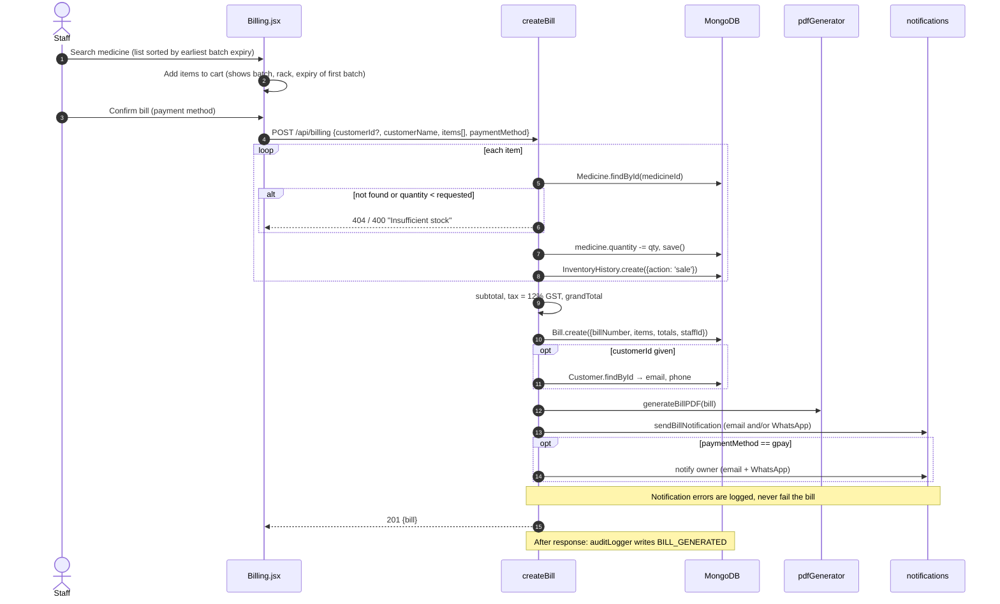
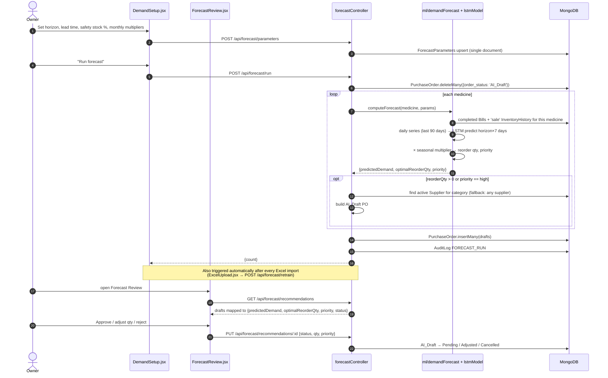
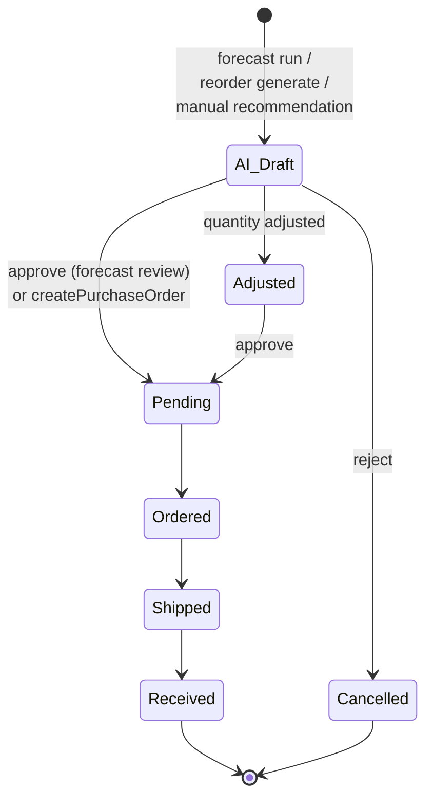
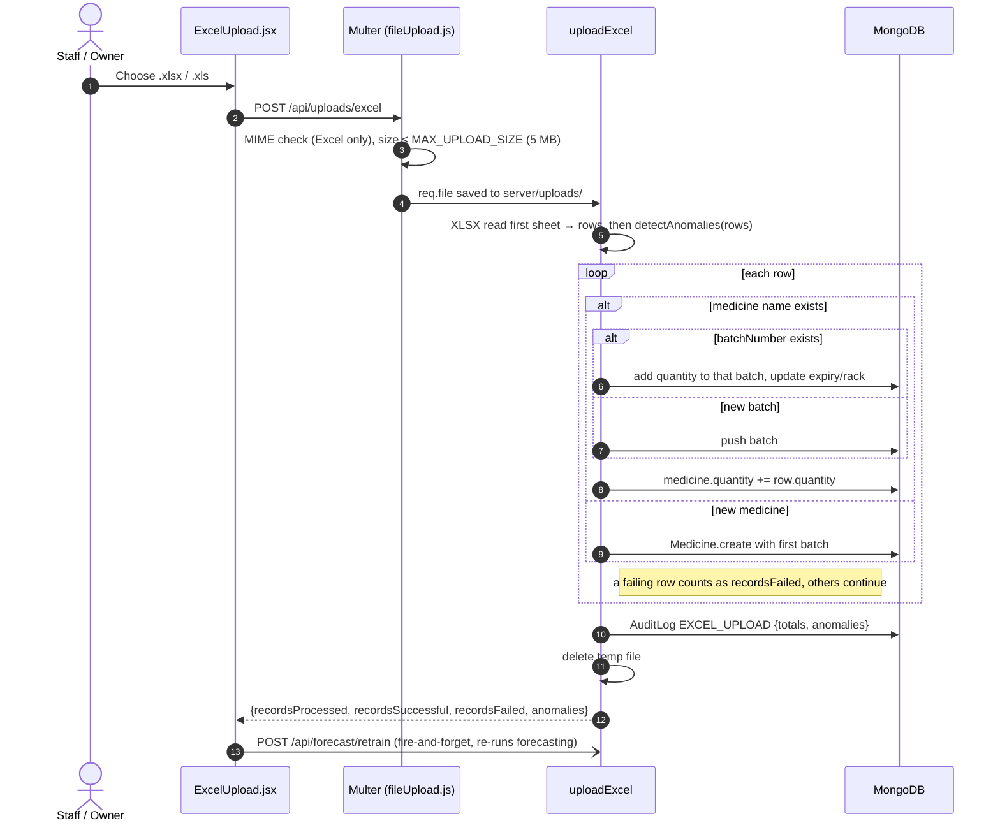

# Core Flows

> **TL;DR** — Four flows carry most of the business value: **billing** (sell stock, record history, notify), **forecast → purchase order** (predict demand, draft POs, human review), **purchase order fulfilment** (receive stock as a new batch, score the supplier), and **Excel import** (bulk-load batches). Each is described below with a sequence or state diagram and its edge cases.

---

## 1. Billing

`POST /api/billing` → `billingController.createBill`

**How FEFO shows up today**

| Where | What happens |
|-------|--------------|
| `GET /api/inventory` | Computes each medicine's earliest batch expiry and returns medicines sorted by it (`sortByFEFO`) |
| `Billing.jsx` | Re-sorts by the first batch's expiry and shows that batch's number, rack and expiry, with a "select nearest expiry first" hint |
| `POST /api/inventory/:id/adjust-quantity` | **True batch-level FEFO:** sorts batches by expiry and deducts from the oldest first |
| `POST /api/billing` | Decrements only the medicine's **total** `quantity`; batch quantities are **not** changed (see limitations) |

### Edge cases

| Case | Behaviour |
|------|-----------|
| Unknown medicine | `404`, bill not created |
| Requested quantity > total stock | `400 Insufficient stock for X. Available: N` |
| Customer without email/phone | Bill still created; notifications skipped |
| Twilio / SMTP not configured or failing | Logged as `WARN`; bill still returned `201` |
| Two cashiers sell the last units at the same time | Both can pass the stock check (read-then-write), so stock can go negative — see limitations |

---

## 2. Forecast → AI purchase order drafts

`POST /api/forecast/run` → `forecastController.runForecast` → `ml/demandForecast.computeForecast`

Details of the model and reorder formula: [forecasting.md](forecasting.md).

There is also a simpler, rule-based path: `POST /api/suppliers/reorder/generate` creates `AI_Draft` POs for every medicine at or below its reorder level, sized at `1.5 × reorderLevel − quantity`, choosing the category supplier with the best `delivery_performance_score`.

### Edge cases

| Case | Behaviour |
|------|-----------|
| Fewer than 7 days of sales history | Skips the LSTM; estimates demand from `reorderLevel / 30` per day |
| 7 days of history exactly | LSTM needs `windowSize + 1` points, so it falls back to a moving average |
| No supplier in the database | That medicine is skipped (no draft) |
| Forecast re-run | **All** existing `AI_Draft` POs are deleted first, including ones created manually |
| Excel import finishes | The client fires `POST /api/forecast/retrain` ("continuous learning"), which runs the full forecast again |

---

## 3. Purchase order lifecycle

On **Received** (`PUT /api/suppliers/purchase-orders/:id`):

1. `received_quantity` defaults to `requested_quantity`.
2. The medicine's total `quantity` increases and a **new batch** is pushed: `batchNumber = B-<order_number>`, `expiryDate = now + 1 year` (placeholder), `rackNumber = 'Receiving Area'`.
3. The supplier's `successful_deliveries` increments and `delivery_performance_score` moves **+0.5** if delivered on or before `expected_delivery_date`, otherwise **−0.5** (clamped to 0–10).

The server does **not** enforce the transitions above: any `order_status` in the enum can be set by `PUT`. The arrows show what the UI (`ReorderReview.jsx`) offers. The `Approved` enum value exists but no current flow sets it.

---

## 4. Excel inventory import

`POST /api/uploads/excel` (multipart, field `file`) → `uploadController.uploadExcel`

Expected columns: `name, category, batchNumber, expiryDate, quantity, rackNumber, purchasePrice, sellingPrice, reorderLevel`.

`detectAnomalies` flags negative quantities, quantities over 100,000, past expiry dates, and selling prices below purchase prices. Anomalies are **reported, not blocked**: the row is still imported.

---

## 5. Alert generation

`POST /api/alerts/generate` scans every medicine and creates at most one unresolved alert per `(medicine, alertType)`:

| Type | Condition | Severity |
|------|-----------|----------|
| `low_stock` | `quantity ≤ reorderLevel / 2` | critical |
| `near_expiry` | expiry within 7 days | warning |
| `expired` | expiry passed | critical |
| `overstock` | `quantity > 3 × reorderLevel` | info |

Alerts older than 24 hours are deleted on each run. Generation is triggered by the client; there is no background schedule.

---

## Design decisions

- **Human-in-the-loop purchasing.** Forecasts only create drafts; money is committed only after a person approves.
- **Stock history as its own collection.** Every sale and adjustment writes an `InventoryHistory` row, giving an audit trail and the raw signal forecasting reads.
- **Receiving creates a batch.** Stock that arrives on a PO becomes a distinct batch, so FEFO and rack lookup keep working.
- **Imports are forgiving.** One bad row doesn't abort a 1,000-row import; results are summarised and audited.

## Known limitations

- **Billing is not batch-aware.** `createBill` lowers `Medicine.quantity` but not `batches[].quantity`, so batch totals drift from the medicine total after sales. It also stores `batchNumber: medicine.batchNumber`, a field that doesn't exist on the schema, so bills carry no batch number. The client does send `batchNumber`, but the server ignores it.
- **No transaction around a bill.** Items are processed one at a time. If item 3 fails validation, items 1–2 have already been deducted and logged, and no bill is saved.
- **Race condition on stock.** "Read quantity, check, subtract, save" is not atomic, so concurrent bills can oversell.
- **Near-expiry and expired alerts don't fire.** `generateAlerts` checks `medicine.expiryDate`, but expiry lives on each batch. Only `low_stock` and `overstock` alerts are produced.
- **Rule-based reorder can fail on zero stock.** `generateReorderSuggestions` sets priority `'Critical'`, which isn't in the PO `priority` enum (`Low | Medium | High`), so `PurchaseOrder.create` throws a validation error for out-of-stock medicines.
- **Received batches get a fake expiry** (now + 1 year) and rack `'Receiving Area'` until someone edits them.

## Future improvements

- Make billing deduct from batches FEFO-style, reusing the logic in `adjustQuantity`, and record the real batch on each bill line.
- Wrap each bill in a **MongoDB transaction** (`session.withTransaction`) and replace read-modify-write with a conditional atomic update, e.g. `updateOne({_id, quantity: {$gte: qty}}, {$inc: {quantity: -qty}})`.
- Validate PO status transitions server-side with an explicit state machine.
- Capture the real expiry and rack when receiving a PO.
- Run alert generation on a schedule.

---

## Related files

- `server/controllers/billingController.js`, `inventoryController.js` (`adjustQuantity`)
- `server/controllers/forecastController.js`, `server/ml/demandForecast.js`
- `server/controllers/supplierController.js`
- `server/controllers/uploadController.js`, `server/middleware/fileUpload.js`
- `server/controllers/alertController.js`
- `src/pages/Billing.jsx`, `src/pages/ai/ForecastReview.jsx`, `src/pages/reorder/ReorderReview.jsx`, `src/pages/ExcelUpload.jsx`
