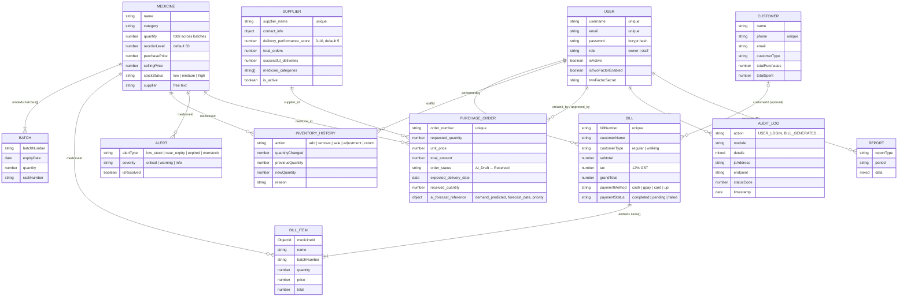

# Data Model

> **TL;DR** — 11 MongoDB collections defined with Mongoose. `Medicine` is the centre: it **embeds its batches** (expiry, rack, quantity per batch) and is referenced by bills, history, alerts and purchase orders. Bills embed their line items as a snapshot. Money-moving and stock-moving events are also written to append-only collections (`InventoryHistory`, `AuditLog`) that feed forecasting and the activity log.

---

## 1. Entity relationships

`ForecastParameters` is a standalone **singleton**: one document holding the forecasting settings, with no relationships.

---

## 2. Collections

| Model (file) | Purpose | Written by | Notable indexes / constraints |
|--------------|---------|------------|-------------------------------|
| `Medicine` (`medicineModel.js`) | Product master + embedded batches | inventory, upload, billing, PO receive | `{ expiryDate: 1 }` (see limitations) |
| `Bill` (`billModel.js`) | Sales invoice with embedded line items | billing | `billNumber` unique |
| `Customer` (`customerModel.js`) | Customer contact + lifetime totals | customers | `phone` unique |
| `User` (`userModel.js`) | Login accounts; password hashed in `pre('save')` | auth | `username`, `email` unique |
| `Supplier` (`supplierModels.js`) | Supplier directory + performance score | suppliers, PO receive | `supplier_name` unique |
| `PurchaseOrder` (`supplierModels.js`) | Drafts and live orders | forecast, suppliers | `order_number` unique |
| `InventoryHistory` (`inventoryHistoryModel.js`) | Append-only stock movement ledger | billing, adjust | — |
| `Alert` (`alertModel.js`) | Stock/expiry alerts | alerts | — |
| `AuditLog` (`auditLogModel.js`) | Append-only activity trail | middleware + explicit calls | `{timestamp:-1}`, `{userId:1,timestamp:-1}`, `{module:1,timestamp:-1}` |
| `ForecastParameters` (`forecastModel.js`) | Singleton forecasting config | forecast | Field ranges: horizon 1–12, lead time 1–60, safety 0–100 |
| `Report` (`reportModel.js`) | Stored report snapshots | seed data | — |

**Categories are not a collection.** `GET /api/categories` returns `Medicine.distinct('category')`. Creating or approving a category is a no-op that returns a message.

---

## 3. Embed vs reference

| Relationship | Choice | Reasoning |
|--------------|--------|-----------|
| Medicine → batches | **Embed** | Batches are always read with their medicine (billing, FEFO, chatbot, rack lookup), are bounded in number, and have no life of their own. One read, one write. |
| Bill → items | **Embed + snapshot** | An invoice must not change when a medicine's name or price changes later, so `name`, `price` and `total` are copied at sale time. `medicineId` is kept for analytics and forecasting. |
| Bill → customer | **Reference, optional** + copied `customerName` | Walk-in customers have no record; the name on the invoice is still preserved. |
| PO → medicine / supplier | **Reference** + copied `medicine_name` | Both have independent lifecycles; the name copy keeps list views cheap. |
| History, audit, alerts → medicine / user | **Reference** + copied name | Append-only logs must stay readable even if the referenced document is deleted. |

This is the standard MongoDB guidance: **embed what you read together and what is bounded; reference what grows unbounded or lives independently.**

---

## 4. How the model supports FEFO

- Each `Medicine.batches[]` entry carries its own `expiryDate`, `quantity` and `rackNumber`.
- `GET /api/inventory` computes each medicine's **earliest batch expiry** and sorts by it.
- `adjustQuantity` sorts a medicine's batches by `expiryDate` ascending and deducts from the oldest first. Stock increases go to the batch with the latest expiry.
- The chatbot treats a batch as *active* only if `quantity > 0` and `expiryDate > today`.

---

## 5. Derived and denormalised fields

| Field | Derived from | Kept in sync by |
|-------|--------------|-----------------|
| `Medicine.quantity` | Sum of `batches[].quantity` (intended) | Each write path updates both by hand |
| `Medicine.stockStatus` | `quantity` vs `reorderLevel` via `getStockStatus()` | Create, adjust, update paths (billing does not recompute it) |
| `Supplier.delivery_performance_score` | On-time vs late receipts | `updatePurchaseOrderStatus` (±0.5, clamped 0–10) |
| `Customer.totalPurchases`, `totalSpent` | Bills | Not updated by `createBill` today |

---

## Design decisions

- **Document model over relational** for a product whose main aggregate (medicine + batches) is naturally hierarchical. See [ADR-0001](adr/0001-mongodb.md).
- **Snapshots on bills** trade storage for historical correctness.
- **Append-only ledgers** (`InventoryHistory`, `AuditLog`) give traceability and feed forecasting without touching the operational documents.
- **Compound indexes on `AuditLog`** match the activity-log screen's queries (newest first, filtered by user or module).

## Known limitations

- **`Medicine.quantity` can drift from the batch total.** Billing updates only the total (see [core-flows.md](core-flows.md#known-limitations)). No validator or hook enforces `quantity == Σ batches.quantity`.
- **The `{ expiryDate: 1 }` index is on a field that doesn't exist** at the top level of `Medicine`; expiry lives in `batches.expiryDate`. The index is unused, and FEFO sorting happens in application code.
- **No index on `Medicine.name`**, yet upload and create look medicines up by name. The same applies to `InventoryHistory.medicineId` and `Bill.items.medicineId`, which forecasting queries per medicine.
- **`Medicine.supplier` is free text**, not a reference to `Supplier`. `createRecommendation` tries `Supplier.findById(medicine.supplier)`, which only works if that string happens to be an ObjectId.
- **`Bill` declares `createdAt`/`updatedAt` by hand and also sets `timestamps: true`.** This is redundant but harmless.
- **`AuditLog` has no retention policy** and will grow forever.

## Future improvements

- Add indexes: `Medicine.name` (unique if names are canonical), `batches.expiryDate`, `InventoryHistory {medicineId, action, createdAt}`, `Bill {'items.medicineId', createdAt}`.
- Enforce the quantity invariant in a `pre('save')` hook, or drop `quantity` and compute it with an aggregation or virtual.
- Turn `Medicine.supplier` into an `ObjectId` reference.
- Add a TTL index or archiving job for `AuditLog`.
- For scale: a **daily sales roll-up collection** (medicineId, date, qty) so forecasting reads a few hundred rows instead of scanning every bill.

---

## Related files

`server/models/*.js` · `server/controllers/inventoryController.js` (`getAllMedicines`, `adjustQuantity`) · `server/utils/helpers.js` (`getStockStatus`, `sortByFEFO`)
