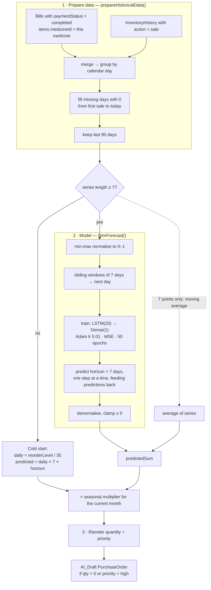

# Demand Forecasting

> **TL;DR** — For each medicine, the server builds a daily sales series (up to 90 days) from bills and stock history, trains a small **LSTM with TensorFlow.js** on it, predicts demand for the next `horizon × 7` days, applies a **monthly seasonal multiplier**, and turns that into a **reorder quantity** using lead time and safety stock. Medicines that need stock become `AI_Draft` purchase orders for a human to approve. Everything runs **in the API process**, either when the owner clicks *Run forecast* on the Demand Setup page or automatically after each Excel import.

---

## 1. Pipeline



---

## 2. Parameters

Stored as a single `ForecastParameters` document, edited on `/ai/demand-setup` (owner only):

| Parameter | Default | Range | Used for |
|-----------|---------|-------|----------|
| `forecastHorizon` | 4 | 1–12 **weeks** | Forecast length = horizon × 7 days |
| `leadTimeDays` | 7 | 1–60 | Demand expected while an order is in transit; also sets the PO's expected delivery date |
| `safetyStockPercent` | 20 | 0–100 | Buffer as % of predicted demand |
| `seasonalMultipliers` | `jan 1.0 … oct 1.4, nov 1.4, dec 1.2` | any | Scales demand by month (e.g. monsoon or festival peaks) |

Model hyper-parameters are hard-coded in `ml/lstmModel.js`: window 7, 20 LSTM units, 50 epochs, learning rate 0.01.

---

## 3. From prediction to reorder quantity

With the LSTM path (`computeForecast`):

```
horizonDays      = forecastHorizon × 7
predictedSum     = Σ LSTM predictions over horizonDays
adjusted         = predictedSum × seasonalMultiplier[currentMonth]
avgDaily         = predictedSum / horizonDays
leadTimeDemand   = avgDaily × leadTimeDays
safetyStock      = safetyStockPercent% × adjusted
optimalReorderQty = ceil( leadTimeDemand + safetyStock + adjusted / forecastHorizon − currentStock ), min 0
```

`adjusted / forecastHorizon` is about **one week of demand**, so the order covers lead-time demand, a week of cover, and the safety buffer, minus what's already on the shelf.

The cold-start path uses the same shape with `daily = reorderLevel / 30` and `adjusted / 4` as the cover term.

**Priority** (`classifyMedicineMovements`):

| Condition | Movement / priority |
|-----------|---------------------|
| Average daily sales > 10 or total > 100 | `fast_moving` → **high** |
| Average < 1 and total < 10 | `slow_moving` |
| `currentStock ≤ reorderLevel` | **high** (overrides) |
| Slow-moving and stock > 2 × reorderLevel | **low** |
| Otherwise | medium |

**Supplier selection:** the first active supplier whose `medicine_categories` includes the medicine's category, or else any supplier.

---

## 4. Accuracy

`server/tests/accuracy.test.js` trains the LSTM on synthetic series:

- **Linear trend** (`10 + 2i`, 40 days): the 7-day total must be within **25%** of the true continuation.
- **Sine-wave seasonality** (60 days): the forecast must be non-constant and positive. This checks that the model learned something, not that it is accurate.
- A third test re-implements a priority threshold inline rather than calling `classifyMedicineMovements`, so it doesn't exercise production code.

In the UI, `GET /api/forecast/trend` shows 14 days of actual sales against predicted values for a visual check.

---

## 5. Performance characteristics

- **Cost per run:** one LSTM trained from scratch **per medicine**, 50 epochs each, run one after another. With M medicines the run is O(M × training time), and all of it happens inside the HTTP request.
- **Memory:** tensors are disposed explicitly (`input.dispose()`, `model.dispose()`) to avoid leaking in the long-lived Node process.
- **Runtime:** uses `@tensorflow/tfjs`, the pure-JavaScript CPU backend, not `tfjs-node`. That's easier to install but much slower.

---

## Design decisions

- **LSTM** because pharmacy demand has short-term momentum and weekly patterns that a sliding-window sequence model can pick up, and a tiny model trains in seconds.
- **Train per medicine, per run** rather than one global model. There's no model storage to manage, and each product fits its own pattern. The trade-off is repeated training cost.
- **A cold-start rule for sparse data.** Neural nets need history; new products fall back to a reorder-level heuristic instead of producing noise.
- **Seasonality as editable multipliers**, not learned. With at most 90 days of history the model can't learn yearly seasonality, so domain knowledge is entered by the owner.
- **Output is a draft, not an order**, keeping a human in the loop for spend decisions.
- **TensorFlow.js in-process** instead of a Python service: one language, one deployable. See [ADR-0003](adr/0003-in-process-forecasting.md).

## Known limitations

- **Holt-Winters is implemented but not used.** `holtWintersForecast` (double exponential smoothing) exists in `ml/demandForecast.js`, but `computeForecast` never calls it. The pipeline is LSTM only, plus the fallbacks. The root README's "Holt-Winters" claim refers to this unused code.
- **No held-out evaluation on real data.** Only synthetic-series tests exist; there's no MAPE or backtest against actual sales.
- **Non-deterministic.** Weights are randomly initialised with no seed, so two runs on the same data can give different numbers.
- **The trend chart can show synthetic predictions.** When no stored forecast exists for a day, `getTrendData` fills the *predicted* line with the actual (or average) value times a deterministic pseudo-random factor (0.88–1.14). That line is illustrative, not a real forecast.
- **Bills and history may double count.** `prepareHistoricalData` adds sales from completed bills *and* `InventoryHistory` rows with `action: 'sale'`, and `createBill` writes both for every sale.
- **Blocking, synchronous run.** A large catalogue makes `POST /forecast/run` slow and ties up CPU for other requests.
- **Re-running deletes all `AI_Draft` POs**, including manually created ones. Because every Excel import triggers a re-run, a bulk import silently discards drafts the owner was in the middle of reviewing.
- `category: medicine.category?.name` is always `'Uncategorized'` because `category` is a string.

## Future improvements

- **Fix the double count**: use one source of truth for sales (a daily roll-up collection).
- **Backtesting**: hold out the last N days, report MAPE/sMAPE per medicine, and pick the best model per SKU (LSTM vs Holt-Winters vs moving average). Wiring in the existing Holt-Winters code as a baseline or ensemble member is cheap.
- **Move off the request path**: enqueue a job, return `202 Accepted`, and let the UI poll or subscribe for progress; add a nightly schedule.
- **Persist models** (`model.save()` to disk or object storage) and fine-tune incrementally instead of training from scratch.
- Use `@tensorflow/tfjs-node` for native speed, or move training to a Python worker if models grow.
- Seed randomness for reproducible results in tests.
- Add expiry awareness: don't recommend ordering more than can be sold before expiry.

---

## Related files

`server/ml/demandForecast.js` · `server/ml/lstmModel.js` · `server/controllers/forecastController.js` · `server/models/forecastModel.js` · `server/tests/accuracy.test.js` · `src/pages/ai/DemandSetup.jsx` · `src/pages/ai/ForecastReview.jsx`
