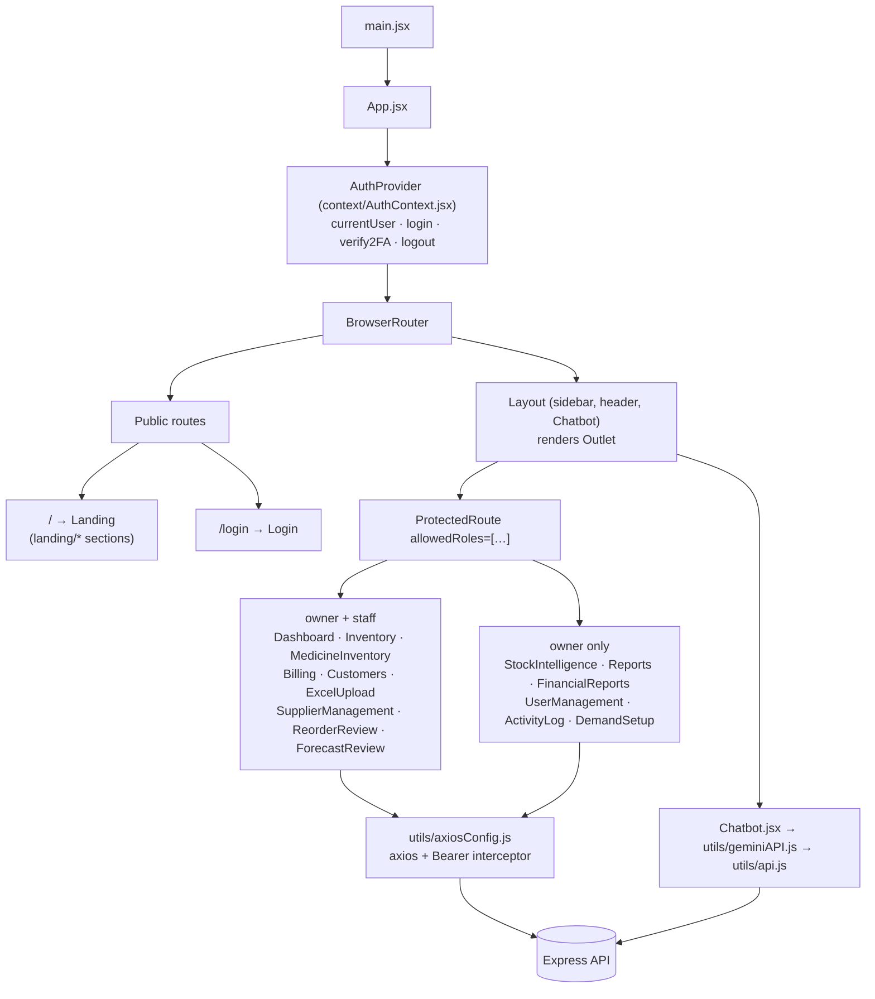
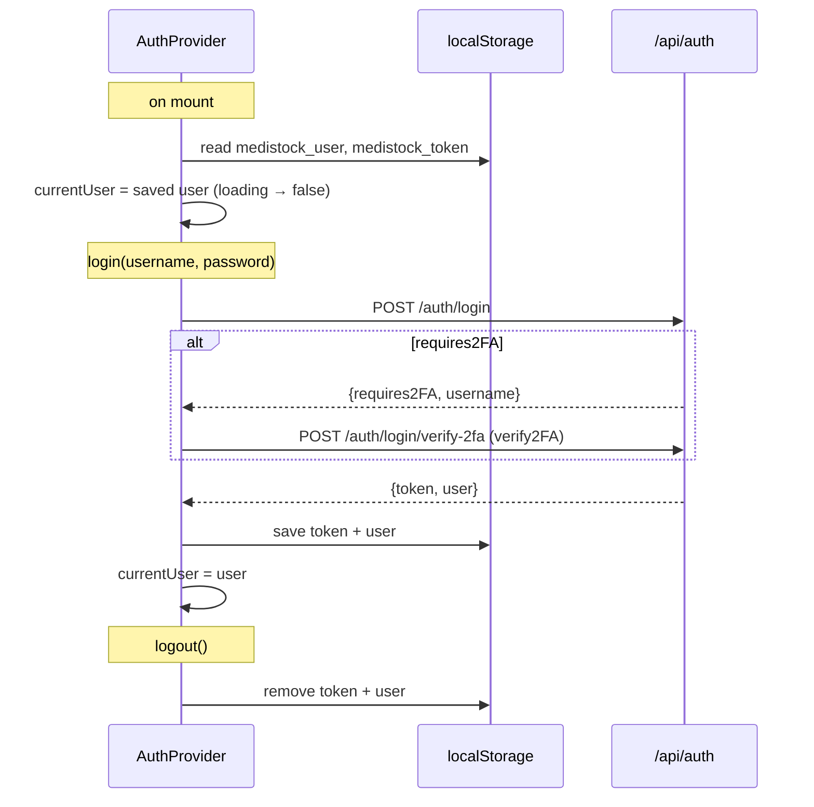

# Frontend

> **TL;DR** — A React 18 single-page app built with Vite. `App.jsx` defines routes; `AuthContext` holds the logged-in user and JWT (persisted in `localStorage`); `ProtectedRoute` gates pages by role; `Layout` provides the sidebar and the floating chatbot. Pages call the API through a shared axios instance that attaches the `Bearer` token.

---

## 1. Structure

---

## 2. Routes

| Path | Page | Roles |
|------|------|-------|
| `/` | `Landing.jsx` | public |
| `/login` | `Login.jsx` | public |
| `/dashboard` | `Dashboard.jsx` | owner, staff |
| `/inventory` | `Inventory.jsx` ("Live Stock") | owner, staff |
| `/medicine-inventory` | `MedicineInventory.jsx` ("Medicine DB") | owner, staff |
| `/billing` | `Billing.jsx` ("Billing POS") | owner, staff |
| `/customers` | `Customers.jsx` | owner, staff |
| `/excel-upload` | `ExcelUpload.jsx` ("Bulk Import") | owner, staff |
| `/suppliers` | `reorder/SupplierManagement.jsx` | owner, staff |
| `/reorder-review` | `reorder/ReorderReview.jsx` | owner, staff |
| `/ai/forecast-review` | `ai/ForecastReview.jsx` | owner, staff |
| `/ai/demand-setup` | `ai/DemandSetup.jsx` | owner |
| `/stock-intelligence` | `StockIntelligence.jsx` ("Stock AI") | owner |
| `/reports` | `Reports.jsx` | owner |
| `/financial-reports` | `FinancialReports.jsx` | owner |
| `/user-management` | `admin/UserManagement.jsx` | owner |
| `/activity-log` | `ActivityLog.jsx` | owner |
| `*` | redirect to `/` | — |

The sidebar in `Layout.jsx` filters its menu items with the same role lists.

---

## 3. Auth state

- The token is attached to each request by the axios **request interceptor** (`Authorization: Bearer …`).
- The **response interceptor** logs a message on `401` but doesn't log the user out or redirect.
- The user object in context includes the `permissions` flags from the login response, for conditional UI.

---

## 4. API clients

There are two axios instances:

| Module | Default base URL | Used by |
|--------|------------------|---------|
| `utils/axiosConfig.js` | `VITE_API_BASE_URL` or `http://localhost:5002/api` | All pages and `AuthContext` |
| `utils/api.js` | `VITE_API_BASE_URL` or `http://localhost:5000/api` | Only `chatbotAPI` (via `geminiAPI.js`); the other exported API groups are unused |

Set `VITE_API_BASE_URL` in the root `.env` so both point to the same server.

---

## 5. UI stack

- **Tailwind CSS** for layout and most styling (`tailwind.config.js`, `index.css`).
- **MUI** (`@mui/material`, `x-data-grid`, `x-date-pickers`) for tables and pickers.
- **Recharts** for dashboards and the forecast trend chart.
- **react-icons** for iconography.
- **Landing page** (`components/landing/*`): marketing sections (Hero, Features, Architecture, AI section, TechStack, Use cases).

---

## 6. Page responsibilities

| Page | Main API calls | Notes |
|------|----------------|-------|
| Dashboard | `/reports/dashboard/analytics`, `/reports/sales`, `/suppliers` | KPI tiles + charts |
| Billing | `/inventory`, `/customers/search`, `POST /billing` | FEFO-sorted medicine picker; cart; 12% GST computed on the server |
| Inventory / MedicineInventory | `/inventory/*` | Batch table, adjust quantity, low stock / near expiry / expired views |
| ExcelUpload | `POST /uploads/excel`, `GET /uploads`, `/uploads/export`, `POST /forecast/retrain` | Shows anomalies and success/failure counts; triggers a forecast re-run after a successful import |
| ForecastReview | `/forecast/recommendations` (CRUD), `/forecast/trend` | Approve / adjust / reject AI drafts; change priority; add a manual recommendation |
| DemandSetup | `/forecast/parameters`, `POST /forecast/run` | Horizon, lead time, safety stock, 12 monthly multipliers; the *Run forecast* button |
| ReorderReview | `/suppliers/purchase-orders` | Move POs Pending → Ordered → Shipped → Received |
| SupplierManagement | `/suppliers/suppliers` | CRUD + performance score |
| UserManagement | `/auth/users`, `/auth/register` | Owner only |
| ActivityLog | `/audit`, `/audit/stats` | Filter by module, user, date |
| SecuritySettingsModal | `/auth/2fa/setup`, `/verify-setup` | QR code for enabling 2FA |

---

## Design decisions

- **Context rather than Redux.** Global state is essentially "who is logged in"; everything else is page-local and fetched on mount, so a store library would be overkill.
- **A layout route with `<Outlet/>`** so the sidebar and chatbot mount once and persist across navigation.
- **Role checks on routes and menu items** so users never see screens they can't use (the server still enforces access).
- **Static hosting** (Vercel + SPA rewrite) with no server rendering: simple and cheap for an authenticated back-office tool.

## Known limitations

- **Missing `/unauthorized` route.** `ProtectedRoute` redirects there on a role mismatch, but the catch-all sends the user to the landing page with no explanation.
- **Session isn't re-validated on load.** The saved user is trusted until an API call fails; an expired token leaves the user "logged in" with failing requests.
- **Two axios instances with different default ports** (5000 vs 5002), which is confusing when `VITE_API_BASE_URL` isn't set.
- **Token in `localStorage`** is readable by XSS; see [security.md](security.md).
- **No data-fetching cache.** Each page refetches on mount; no request de-duplication or background refresh.
- **The dashboard calls an owner-only endpoint.** It requests `/reports/sales`, which is `ownerOnly`, so for staff that request fails with `403` and the related widgets stay empty.
- Speech recognition only works in browsers that implement `webkitSpeechRecognition` (Chromium-based).

## Future improvements

- Add an `Unauthorized` page; on a `401`, clear auth and redirect to `/login` from the interceptor.
- Call `GET /api/auth/me` on start-up to validate the stored token.
- Merge into one axios instance; delete unused API groups in `utils/api.js`.
- Adopt **TanStack Query** for caching, retries and loading states.
- Lazy-load owner-only and AI pages (`React.lazy`) to shrink the initial bundle.

---

## Related files

`src/App.jsx` · `src/context/AuthContext.jsx` · `src/components/ProtectedRoute.jsx` · `src/components/Layout.jsx` · `src/utils/axiosConfig.js` · `src/utils/api.js` · `src/pages/`
