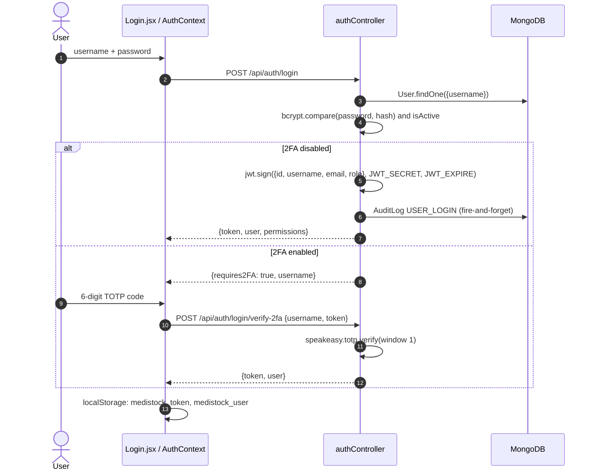
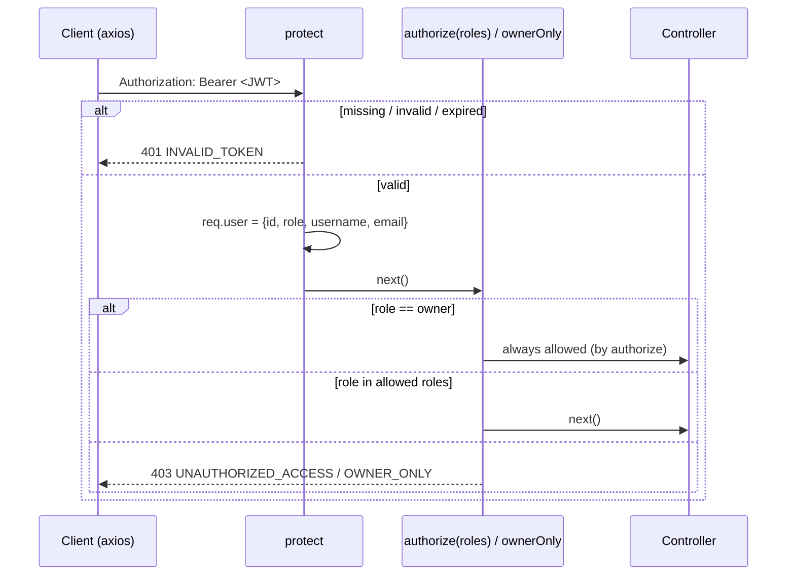

# Security

> **TL;DR** — Users log in with username + password (bcrypt), optionally followed by a TOTP code. The server issues a **stateless JWT** (default 7 days) carrying `id, username, email, role`. Every protected route runs `protect` (verify JWT) and then a role guard (`authorize` / `ownerOnly`). The client mirrors the roles with `ProtectedRoute`, but **the server is the source of truth**. Mutations are written to an audit log. Secrets stay on the server.

---

## 1. Authentication

### Login and 2FA

### Enabling 2FA

1. `POST /api/auth/2fa/setup` generates a secret and returns it with a QR code data URL. Nothing is saved yet.
2. The user scans the QR code in an authenticator app, then `POST /api/auth/2fa/verify-setup {token, secret}`.
3. If the code verifies, the secret is saved to `twoFactorSecret` and `isTwoFactorEnabled` is set to `true`.

Saving the secret only after a successful verification means a half-finished setup can't lock the user out.

### Passwords

- Hashed with **bcryptjs** (salt rounds 10) in a Mongoose `pre('save')` hook, only when the password field changed.
- Compared with `user.matchPassword()`.
- Login returns the same `Invalid credentials` message for an unknown user and a wrong password, so usernames can't be enumerated through that message.

---

## 2. Authorization (RBAC)

### Request-time checks

### Role matrix (server-enforced)

| Capability | Owner | Staff |
|------------|:-----:|:-----:|
| View inventory, bills, customers, alerts, dashboard | ✅ | ✅ |
| Create bills, confirm payments | ✅ | ✅ |
| Create/update medicines, adjust stock | ✅ | ✅ |
| **Delete** medicines or customers | ✅ | ❌ |
| Excel import / export | ✅ | ✅ |
| Generate / resolve alerts | ✅ | ✅ |
| Stock intelligence (`/inventory/intelligence`) | ✅ | ❌ |
| Sales and purchase reports | ✅ | ❌ |
| Create/update suppliers | ✅ | ❌ |
| Generate reorder drafts, update PO status | ✅ | ✅ |
| Activate a PO from a draft (`POST /suppliers/purchase-orders`) | ✅ | ❌ |
| Run forecast, save forecast parameters | ✅ | ❌ |
| Review / approve forecast recommendations | ✅ | ✅ |
| User management, register users | ✅ | ❌ |
| Audit log | ✅ | ❌ |
| Chatbot | ✅ | ✅ |

User-management safeguards in `authController`: you can't delete yourself, you can't delete another owner, and you can't change your own role.

### Client-side mirror

`src/components/ProtectedRoute.jsx` redirects to `/login` when there's no user and blocks routes whose `allowedRoles` don't include the user's role. The login response also includes a `permissions` object (`canViewFinancials`, `canManageUsers`, …) for showing or hiding UI. **These are UX conveniences only.** Anyone can edit `localStorage`, which is why every sensitive endpoint is also guarded on the server.

---

## 3. Auditing

| Mechanism | What it records |
|-----------|-----------------|
| `auditLogger` middleware | Every successful `POST/PUT/PATCH/DELETE`: user, action and module (inferred from the path), sanitised body and params, IP (honours `X-Forwarded-For`), method, endpoint, status |
| `createAuditEntry()` / direct `AuditLog.create` | Login (`USER_LOGIN`, including 2FA logins), Excel upload details, forecast runs |
| Body sanitising | Keys `password`, `token`, `secret`, `key` and `auth` become `[REDACTED]` (top level only) |

Owners browse the log at `/activity-log` (`GET /api/audit`, `GET /api/audit/stats`).

---

## 4. Secrets and external services

- All secrets live in `server/.env`: `JWT_SECRET`, `MONGODB_URI`, `GEMINI_API_KEY`, `EMAIL_*`, `TWILIO_*`.
- The frontend only knows `VITE_API_BASE_URL`. The Gemini key used to be on the client and was moved behind `/api/chatbot/query`; see [ADR-0004](adr/0004-gemini-via-backend.md).
- Local MongoDB in `docker-compose.yml` binds to `127.0.0.1` only, with root credentials read from `.env`.

---

## 5. File uploads

| Control | Where |
|---------|-------|
| Auth + role (`owner`/`staff`) before Multer runs | `uploadRoutes.js` |
| MIME allow-list: `.xlsx` / `.xls` MIME types only | `fileUpload.js` `fileFilter` |
| Size limit `MAX_UPLOAD_SIZE` (default 5 MB) | `fileUpload.js` |
| Server-generated file name (`file-<timestamp>-<random>.<ext>`) so user input never becomes a path | `fileUpload.js` |
| Temp file deleted after processing | `uploadController.js` |
| Static `/uploads` served with `nosniff`, `CSP default-src 'none'`, `X-Frame-Options: DENY` | `server.js` |

---

## 6. CORS

Allowed origins come from `FRONTEND_URL` (comma-separated). Requests with no `Origin` header are allowed. `credentials: true` is set, although auth uses the `Authorization` header rather than cookies.

---

## Design decisions

- **Stateless JWT over server sessions.** No session store is needed and the API scales horizontally without sticky sessions. The cost is that tokens can't be revoked before they expire. See [ADR-0002](adr/0002-jwt-auth.md).
- **Role embedded in the token.** The role check needs no database lookup per request. The downside: a role change or deactivation only takes effect when the token expires.
- **Defence in depth.** Guards run on both client and server; the server is authoritative.
- **Audit without coupling.** Logging is centralised in middleware so controllers don't have to remember it.

## Known limitations

These are known gaps, roughly in order of severity:

1. **The 2FA step is not bound to the password step.** `POST /api/auth/login/verify-2fa` accepts `{username, token}` alone and issues a JWT. Anyone holding a user's current TOTP code can log in without the password. The fix is to have `/login` return a short-lived, single-purpose "pre-auth" token that `/verify-2fa` must present.
2. **TOTP secrets are returned by the API.** `GET /api/auth/me` and `GET /api/auth/users` exclude only `password`, so `twoFactorSecret` is included in their responses. Secrets are also stored in plaintext.
3. **`POST /api/forecast/retrain` has no `ownerOnly` guard** but calls `runForecast`. This is probably deliberate, because `ExcelUpload.jsx` calls it after every import and staff can import. The effect is that staff can trigger a full forecast run, which deletes all current AI drafts, even though `/run` is owner-only.
4. **Tokens can't be revoked.** Logout only clears `localStorage`. Deactivating a user doesn't invalidate their existing JWT, and `protect` never re-checks `isActive`.
5. **The JWT is stored in `localStorage`**, which any XSS on the origin can read.
6. **No rate limiting or lockout** on `/login` or `/login/verify-2fa`, so passwords and 6-digit codes can be brute-forced.
7. **Some unguarded reads.** Most `GET` routes need only `protect`, so staff can call `GET /api/billing/summary` and the dashboard analytics endpoints even though the financial *pages* are owner-only on the client.
8. **Raw error messages** (`error: error.message`) are returned to clients from most controllers.
9. **No security headers on API responses** (no `helmet`) and **no schema validation** (`express-validator` is installed but unused).
10. **Chatbot safety settings are `BLOCK_NONE`**, and the Gemini key is sent as a URL query parameter, which can end up in proxy logs.

## Future improvements

- Pre-auth token for 2FA; encrypt `twoFactorSecret` at rest and exclude it from all queries (`select: false` in the schema).
- Short-lived access token (about 15 min) plus a rotating **refresh token in an `httpOnly`, `SameSite` cookie**, and a token version on `User` so deactivation or role changes revoke access immediately.
- `express-rate-limit` on auth routes; account lockout after repeated failures.
- `helmet`, request validation, and sanitised error messages in production.
- Add `ownerOnly` to `/forecast/retrain`; review every `GET` that exposes financial data.
- Send the Gemini key in the `x-goog-api-key` header.

---

## Related files

`server/middleware/auth.js` · `server/controllers/authController.js` · `server/utils/helpers.js` (`generateToken`) · `server/middleware/auditLogger.js` · `server/middleware/fileUpload.js` · `src/context/AuthContext.jsx` · `src/components/ProtectedRoute.jsx`
