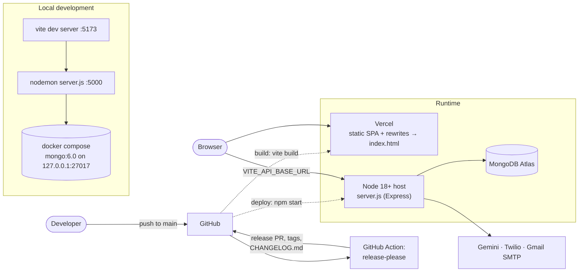

# Setup, Testing and Deployment

> **TL;DR** — Run MongoDB (Docker Compose or Atlas), create `server/.env` from `.env.example` (including **`FRONTEND_URL`**), start the API with `npm run dev` in `server/` and the SPA with `npm run dev` at the root. Create the first owner account by hand, then seed demo data. Tests use Jest (`cd server && npm test`). The SPA deploys to Vercel as a static site; the API runs on any Node 18+ host. Releases are automated with release-please.

---

## 1. Deployment view



The API host isn't pinned in the repo: nothing in it configures the backend's hosting. Any platform that runs `npm start` with the environment variables below will work (Render, Railway, a VM, a container).

---

## 2. Environment variables

### Backend — `server/.env`

| Variable | Required | Default | Purpose |
|----------|:--------:|---------|---------|
| `MONGODB_URI` | ✅ | — | Connection string. The process exits if the connection fails. |
| `JWT_SECRET` | ✅ | — | JWT signing key. Use a long random value. |
| `FRONTEND_URL` | ✅ | — | Comma-separated CORS allow-list. **The server crashes at start-up if unset** (`.split` on `undefined`). |
| `PORT` | | `5000` | API port |
| `NODE_ENV` | | — | `development` adds stack traces to errors; `test` skips `app.listen` |
| `JWT_EXPIRE` | | `7d` | Token lifetime |
| `GEMINI_API_KEY` | | — | Without it the chatbot always uses the keyword fallback |
| `GEMINI_API_URL` | | gemini-2.0-flash `generateContent` | Override the model endpoint |
| `EMAIL_SERVICE` | | — | Nodemailer service name, e.g. `gmail` |
| `EMAIL_USER`, `EMAIL_PASSWORD` | | — | SMTP credentials (for Gmail, an **app password**) |
| `TWILIO_ACCOUNT_SID`, `TWILIO_AUTH_TOKEN`, `TWILIO_WHATSAPP_NUMBER` | | — | WhatsApp notifications; skipped if missing |
| `OWNER_WHATSAPP_NUMBER` | | — | Receives GPay payment alerts |
| `MAX_UPLOAD_SIZE` | | `5242880` | Excel upload limit in bytes |

`server/.env.example` has all of these with setup notes for Gmail and the Twilio sandbox. It also lists `OWNER_EMAIL` and `UPLOAD_DIR`, which the code doesn't read.

### Frontend and Docker — root `.env`

| Variable | Purpose |
|----------|---------|
| `VITE_API_BASE_URL` | API base, e.g. `http://localhost:5000/api`. **Set it**: the two axios clients have different fallbacks (5000 and 5002). |
| `MONGO_ROOT_USER`, `MONGO_ROOT_PASSWORD` | Root credentials for the Docker Compose MongoDB |

---

## 3. Local development

```bash
# 1. Install
npm install
cd server && npm install && cd ..

# 2. Database (or use an Atlas URI instead)
docker compose up -d        # mongo:6.0, bound to 127.0.0.1:27017

# 3. Configure
cp server/.env.example server/.env    # then edit: MONGODB_URI, JWT_SECRET, FRONTEND_URL
echo 'VITE_API_BASE_URL="http://localhost:5000/api"' >> .env

# 4. Run (two terminals)
cd server && npm run dev    # nodemon → http://localhost:5000  (health: /api/health)
npm run dev                 # vite    → http://localhost:5173
```

With the Docker database, `MONGODB_URI` needs the root credentials and `authSource`, e.g.
`mongodb://admin:<password>@localhost:27017/medistock?authSource=admin`.

### Create the first owner

`POST /api/auth/register` needs an existing owner, and the seed scripts expect users to exist already, so the first account has to be created directly. Run this from `server/` so the model's bcrypt hook hashes the password:

```bash
node --input-type=module -e "
import 'dotenv/config';
import mongoose from 'mongoose';
import { User } from './models/userModel.js';
await mongoose.connect(process.env.MONGODB_URI);
await User.create({ username: 'owner', email: 'owner@example.com', password: 'change-me', role: 'owner' });
console.log('owner created'); process.exit(0);
"
```

Then log in and create staff users from **User Management**.

### Seed demo data

| Script | Command | What it does |
|--------|---------|--------------|
| `seedFiles/seedAll.js` | `npm run seed` | **Deletes** medicines, customers, bills, suppliers, history, audit logs, POs, alerts and reports, then generates a full demo dataset (30 days of billing volume, forecast history). Users are kept. |
| `seedFiles/seedTemporal.js` | `npm run seed:temporal` | Refreshes time-relative data (bills, sales history, audit logs, alerts, POs) so dashboards look current |

Never point the seed scripts at production: `seedAll` wipes collections.

### Maintenance scripts (`server/misc/`)

| Script | Purpose |
|--------|---------|
| `check-db.js` | Print collections and counts (hard-coded to `mongodb://localhost:27017/medistock`) |
| `migrate_categories.js` | One-off category migration |
| `diagnose_cast_error.js` | Debug helper for Mongoose cast errors |

---

## 4. Testing

```bash
cd server
npm test        # node --experimental-vm-modules jest (ESM)
```

| Suite | Type | Needs MongoDB? | Covers |
|-------|------|:--------------:|--------|
| `__tests__/billing.math.test.js` | Unit | No | Price, discount, tax and change arithmetic |
| `__tests__/billing.helpers.test.js` | Unit | No | Formatting, validation and invoice-number helpers |
| `__tests__/billing.controller.test.js` | Unit-style | No | Billing rules: stock checks, deduction, payment methods |
| `tests/accuracy.test.js` | Model | No | LSTM on synthetic trend and seasonal data (30 s timeout) |
| `tests/upload.test.js` | Integration (Supertest) | **Yes** | `POST /api/uploads/excel` end to end against `server.js` |

Coverage is collected from `controllers/` and `utils/` (`jest.config.js`).

Without a database, the four suites that don't need MongoDB pass (133 tests). `upload.test.js` fails because importing `server.js` runs `connectDB()` at the top level. Set `MONGODB_URI` (and `FRONTEND_URL`) before running the full suite.

**Gaps worth knowing:**

- The three `__tests__/billing.*` suites define their logic **inside the test files** and don't import the production controller or helpers. They document the intended rules but won't catch regressions in `billingController.js`.
- There are no tests for auth, RBAC guards, 2FA, forecasting (`computeForecast`), purchase orders, alerts or the chatbot.
- There's no frontend test setup.
- No CI workflow runs tests. The only workflow is release-please.

Good next tests: Supertest cases for `protect`/`authorize` on each router, the 2FA login path, `createBill` against an in-memory MongoDB (`mongodb-memory-server`), and `adjustQuantity` FEFO deduction.

---

## 5. Deployment

**Frontend (Vercel)**

- Build: `npm run build` → `dist/`.
- `vercel.json` rewrites every path to `/index.html` (SPA routing); `public/_redirects` does the same on Netlify.
- Set `VITE_API_BASE_URL` in the Vercel project settings. Vite inlines it at **build time**.

**Backend**

- `npm start` (`node server.js`) on Node 18+.
- Set every required variable from section 2. Add the deployed frontend origin to `FRONTEND_URL`.
- The process needs **write access** to `server/uploads/` (temp Excel files, invoice PDFs) and `server/logs/`. On platforms with ephemeral disks those files don't survive restarts.
- Health check path for the platform: `/api/health`.

**Database:** MongoDB Atlas. Allow the API host's egress IPs in the Atlas network access list.

---

## 6. Releases

- **release-please** (`.github/workflows/release-please.yml`) runs on every push to `main`.
- It's configured as a monorepo with two packages: `.` → `medistock-frontend` and `server` → `medistock-backend`, each with its own version (see `.release-please-manifest.json`) and `CHANGELOG.md`.
- Write **Conventional Commits** (`feat:`, `fix:`, `refactor(scope):`, `docs:`). release-please opens a release PR that bumps versions and updates changelogs; merging it creates the tags and GitHub releases.

---

## Known limitations

- The first-owner bootstrap is manual.
- No CI for tests, lint or build on pull requests.
- No Dockerfile for the API; Compose only runs MongoDB.
- Local-disk state (`uploads/`, `logs/`) doesn't suit horizontally scaled or ephemeral hosts.
- The root `README.md` clone URL points to `kanishmanickam/Fullstack_Pharma_project`, and its env section omits `FRONTEND_URL`.

## Future improvements

- A `seed:admin` script (or an env-driven bootstrap) that creates the first owner.
- A CI workflow on pull requests: install, `npm test`, `vite build`, and lint.
- A Dockerfile for the API and a Compose profile that runs the whole stack.
- Object storage (S3/GCS) for generated PDFs; stdout-only logging, collected by the platform.

---

## Related files

`server/.env.example` · `docker-compose.yml` · `vercel.json` · `public/_redirects` · `server/package.json` · `server/jest.config.js` · `server/seedFiles/` · `.github/workflows/release-please.yml` · `release-please-config.json`
